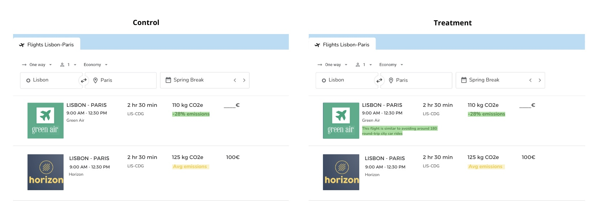

```{r setup, include=FALSE,message=FALSE, echo=FALSE, warning=FALSE}
knitr::opts_chunk$set(echo = TRUE)
```

```{r load libraries,message=FALSE, echo=FALSE, warning=FALSE}
rm(list = ls()) # Wipes everything clean

library(tidyverse)
library(data.table)
library(stargazer) 
library(broom)
library(ggfortify)
library(ggthemes) 
library(GGally)
library(skimr)
library(corrr)
library(knitr)
library(kableExtra)
library(gridExtra)
library(gt)
library(viridis)
library(lmtest)
library(dplyr)
library(ggplot2)
library(dplyr)
library(tibble)
library(grid)
library(sandwich)
# load the libraries required for power analysis
library(pwr)
library(powerMediation)
```

```{r load data, message=FALSE, include=FALSE, warning=FALSE}
# Read comma delimited file 
co2_flights <- read_csv("carbon_emissions_flights.csv")

# Remove rows 1 and 2
co2_flights <- co2_flights[-c(1, 2), ]

# Filter out rows where 'Distribution Channel' is 'preview' and 'progress' is not 100
co2_flights <- co2_flights[co2_flights$DistributionChannel != "preview" & co2_flights$Progress == 100, ]

# Renaming the columns
colnames(co2_flights) <- c("StartDate", "EndDate", "Status", "IPAddress", "Progress", 
                           "Duration_in_seconds", "Finished", "RecordedDate", "ResponseId", 
                           "RecipientLastName", "RecipientFirstName", "RecipientEmail", 
                           "ExternalReference", "LocationLatitude", "LocationLongitude", 
                           "DistributionChannel", "UserLanguage", "flight_frequency", "flight_duration", "price_importance", 
                           "route_importance", "airline_importance", "sustainable_practices_importance1", "meals_importance", "baggage_importance", "priority_boarding_importance", "seating_importance", 
                           "security_screening_importance", "sustainable_practices_importance2", "env_1", "env_2", "env_3", "env_4", "env_5", 
                           "eth_1", "eth_2", "eth_3", "eth_4", "eth_5", "WTP", "nationality", 
                           "nationality_2", "gender", "age", "education_level", "work_status", "household_income", "ImageShown")


# Create a new column 'group' based on the last two digits of 'ImageShown'
co2_flights$group <- ifelse(substr(co2_flights$ImageShown, nchar(co2_flights$ImageShown)-1, nchar(co2_flights$ImageShown)) == "13", 1, 0)

co2_flights <- co2_flights %>%
  filter(!is.na(nationality))

# Checking
is_tibble(co2_flights)
```

```{r adjust data, message=FALSE, include=FALSE, warning=FALSE}

co2_flights$env_1_numeric <- as.numeric(factor(co2_flights$env_1, levels = c("Strongly Disagree", "Diasagree", "Neither Agree nor Disagree", "Agree", "Strongly Agree")))

co2_flights$env_2_numeric <- as.numeric(factor(co2_flights$env_2, levels = c("Strongly Disagree", "Diasagree", "Neither Agree nor Disagree", "Agree", "Strongly Agree")))

co2_flights$env_3_numeric <- as.numeric(factor(co2_flights$env_3, levels = c("Strongly Disagree", "Diasagree", "Neither Agree nor Disagree", "Agree", "Strongly Agree")))

co2_flights$env_4_numeric <- as.numeric(factor(co2_flights$env_4, levels = c("Strongly Disagree", "Diasagree", "Neither Agree nor Disagree", "Agree", "Strongly Agree")))

co2_flights$env_5_numeric <- as.numeric(factor(co2_flights$env_5, levels = c("Strongly Disagree", "Diasagree", "Neither Agree nor Disagree", "Agree", "Strongly Agree")))

co2_flights$env_mean <- rowMeans(co2_flights[, c("env_1_numeric", "env_2_numeric", "env_3_numeric", "env_4_numeric", "env_5_numeric")], na.rm = TRUE)

```


```{r adjust data2, message=FALSE, include=FALSE, warning=FALSE}

co2_flights$eth_1_numeric <- as.numeric(factor(co2_flights$eth_1, levels = c("Strongly Disagree", "Diasagree", "Neither Agree nor Disagree", "Agree", "Strongly Agree")))

co2_flights$eth_2_numeric <- as.numeric(factor(co2_flights$eth_2, levels = c("Strongly Disagree", "Diasagree", "Neither Agree nor Disagree", "Agree", "Strongly Agree")))

co2_flights$eth_3_numeric <- as.numeric(factor(co2_flights$eth_3, levels = c("Strongly Disagree", "Diasagree", "Neither Agree nor Disagree", "Agree", "Strongly Agree")))

co2_flights$eth_4_numeric <- as.numeric(factor(co2_flights$eth_4, levels = c("Strongly Disagree", "Diasagree", "Neither Agree nor Disagree", "Agree", "Strongly Agree")))

co2_flights$eth_5_numeric <- as.numeric(factor(co2_flights$eth_5, levels = c("Strongly Disagree", "Diasagree", "Neither Agree nor Disagree", "Agree", "Strongly Agree")))

co2_flights$eth_mean <- rowMeans(co2_flights[, c("eth_1_numeric", "eth_2_numeric", "eth_3_numeric", "eth_4_numeric", "eth_5_numeric")], na.rm = TRUE)

co2_flights <- co2_flights %>%
  select(-StartDate, -EndDate, -IPAddress,-Duration_in_seconds,-Finished, -Status, -RecordedDate,-ResponseId,-RecipientLastName,-RecipientFirstName,-RecipientEmail,-ExternalReference,-LocationLatitude,-LocationLongitude,-UserLanguage,-price_importance,-route_importance,-airline_importance,-sustainable_practices_importance1,-meals_importance,-baggage_importance,-priority_boarding_importance,-seating_importance,-security_screening_importance,-sustainable_practices_importance2,-env_1,-env_2,-env_3,-env_4,-env_5,-eth_1,-eth_2,-eth_3,-eth_4,-eth_5,-env_1_numeric,-env_2_numeric,-env_3_numeric,-env_4_numeric,-env_5_numeric,-eth_1_numeric,-eth_2_numeric,-eth_3_numeric,-eth_4_numeric,-eth_5_numeric )


```

\newpage

# 1. Introduction

As global awareness of environmental issues grows, understanding how travelers make decisions that balance cost, convenience, and sustainability has become increasingly important. 

This study explores how individuals respond to information about the carbon footprint of flights, particularly focusing on the impact of how this information is presented. The central research question guiding this project is: Does the framing of carbon emissions — whether as raw numerical data or as humanized analogies — affect a traveler's willingness to pay more for lower-emission flights? 

We hypothesize that humanized representations of carbon data make environmental impacts more relatable and may encourage consumers to opt for greener travel options. By analyzing survey responses from a flight booking scenario, this study aims to uncover the psychological factors that influence eco-conscious travel behaviors through the formally stated hypothesis below.
 
- (Null Hypothesis): There is no difference in the mean willingness to pay (WTP) for lower-emission flights between the control group and the treatment group.
$$
H_0: \mu_{\text{control}} = \mu_{\text{treatment}}
$$
- (Alternative Hypothesis): There is a difference in the mean willingness to pay (WTP) for lower-emission flights between the control group and the treatment group.
$$
H_a: \mu_{\text{control}} \neq \mu_{\text{treatment}}
$$

## 1.1. Business Case

The aviation industry is a significant source of carbon dioxide (CO2) emissions, contributing approximately 2–3% of global CO2 output (Lee et al., 2021). With air travel expected to expand in the coming decades, the sector’s share of global emissions is projected to rise substantially (Lee et al., 2009). Achieving global net-zero emissions and limiting climate change to 1.5°C will require considerable efforts to reduce aviation-related emissions. However, decarbonizing this sector poses substantial challenges due to its dependence on high energy-density fuels that currently lack practical alternatives (Bergero et al., 2023). In the absence of comprehensive regulatory measures, much of the responsibility for reducing emissions has fallen on voluntary initiatives by airlines and consumers (Gössling et al., 2021).

One promising approach to mitigating emissions involves influencing traveler behavior. Airlines and travel platforms have begun integrating carbon emissions data into booking systems to nudge consumers toward more sustainable options. For instance, since 2021, Google Flights has displayed carbon emissions data for individual flights, and by 2024, this information had been included in over 65 billion searches via Travalyst-affiliated platforms (Travalyst, 2024). 

If presenting emissions data in an accessible format leads travelers to favor lower-emission flights, it could drive demand-side pressure on airlines to invest in cleaner technologies. Evaluating the effectiveness of these interventions hinges on understanding consumers' willingness to pay for lower-emission flights. By assessing how different framings of emissions information affect purchasing behavior, this research can inform airlines and policymakers on how to better promote sustainable air travel.

## 1.2. Literature Review

The existing body of research underscores the importance of message framing in shaping consumer decisions, particularly in contexts involving ethical consumption. Studies such as Smith et al. (2021) demonstrate that purely numerical data about carbon emissions often lacks emotional resonance with consumers, whereas humanized analogies—like equating emissions to the number of trees needed to absorb the CO2—can make environmental impacts more tangible. Johnson and Lee (2020) similarly found that framing environmental data in relatable ways increases the likelihood of consumers making sustainable choices.

While there is a growing literature on framing effects in areas such as energy use and food consumption, fewer studies have examined how these dynamics influence travel decisions. Existing research on willingness to pay for lower-emission flights (e.g., Baumeister et al., 2022; Carroll et al., 2022; Sanguinetti & Amenta, 2022; Song et al., 2024; Crosby, Thompson & Best, 2024) often employs discrete choice experiments but faces notable limitations. Many studies use non-representative samples and do not differentiate between leisure and business travelers, even though these groups may have different priorities and constraints. Furthermore, some experimental designs fail to accurately replicate real-world booking environments, raising concerns about hypothetical bias and external validity.

This study seeks to address these gaps by using a more realistic choice experiment modeled after popular booking interfaces, such as Google Flights, and by separately analyzing the responses. This approach allows for a more nuanced understanding of how different groups perceive emissions data and how framing affects their willingness to pay for greener flights. Ultimately, this research contributes to the broader discourse on sustainable consumption and behavioral economics, offering practical insights for airlines and policymakers aiming to reduce the aviation sector’s carbon footprint.

# 2. Experimental Design

To investigate whether the framing of carbon emissions affects travelers' willingness to pay (WTP) for lower-emission flights, we implemented a completely randomized experimental design. In this approach, participants were divided into treated and control groups in the form of a survey in an A/B setting created on the platform Qualtrics. In this sense, participants were randomly assigned to one of two conditions: one group, (control), received carbon emissions information in raw numerical terms (e.g., kilograms of CO2), while the other group, (treatment), was presented with "humanized" analogies (e.g., the equivalent number of football fields).

This approach ensures that a fixed number of subjects receive the treatment, with assignments made randomly to balance the groups as much as possible. While the number of treated and control units does not have to be equal, it is predetermined to ensure sufficient representation in both groups. Complete randomization does not stratify participants based on predefined variables; this method simplifies the experimental design and allows for broader generalizability of results. 

While a completely randomized design has its strengths, it is not without limitations. The random assignment of participants to different conditions may still introduce variability due to individual differences that are not controlled for. Additionally, common survey-related challenges such as response bias could affect the validity of our findings. Nonetheless, this design should allow us to make meaningful conclusions about how the framing of carbon emissions influences travelers' decisions.

Despite this limitation, complete randomization remains a widely used approach for estimating causal effects, ensuring that differences in responses are attributable to the treatment rather than systematic pre-existing differences between participants.

When designing the survey, we considered several potential challenges to ensure the reliability and generalizability of our results. One of the primary concerns was the risk of a homogenous respondent pool in terms of demographics such as age, nationality, or occupation, which could limit the generalizability of our findings. To address this, we made efforts to recruit participants from diverse geographical locations and encouraged participants, especially family and friends, to share the survey within their networks to reach varied age groups and backgrounds.

We also acknowledged the limited attention span of participants and aimed to minimize survey fatigue. To mitigate this, we designed the survey to be as concise as possible, using clear and straightforward language. The questions were structured to be easy to understand, and the answer options were kept simple to maximize response rates, ensure comparability, and facilitate subsequent data analysis.

Another consideration was the framing of carbon emission information in the survey. We aimed to avoid introducing bias that could stem from participants' prior associations or experiences. For instance, when presenting humanized framing examples, such as comparing carbon emissions to the number of football fields, we ensured that these comparisons were neutral and universally understandable, avoiding culturally specific references that might influence participants' responses.

```{r, echo=FALSE, fig.cap="Images displayed for Control and Treatment Groups in Survey"}

```

From an ethical standpoint, we prioritized participant confidentiality and voluntary participation. A confidentiality statement was included at the beginning of the survey, informing participants that their responses would remain anonymous, data would be kept confidential, and participation was entirely voluntary.

The complete survey design and materials can be found in the appendix.

To rigorously evaluate the causal effect of framing on WTP, we specify the following baseline regression model:

$$
WTP_{i} = \beta_0 + \beta_1 \text{Humanized}_{i} + \epsilon_{i}
$$

Where \(\text{WTP}_{i}\) represents the willingness to pay for individual \(\text{i}\) and \(\text{Humanized}_{i}\) is a binary variable indicating whether the participant received the humanized framing. The coefficient \(\beta_1\) captures the direct impact of framing on WTP.

Since treatment effects may vary across individuals, we extend the model to account for heterogeneous treatment effects by incorporating key demographic covariates :

$$
WTP_{i} = \beta_0 + \beta_1 \text{Humanized}_{i} + \beta_2 \text{Gender}_{i} + \beta_3 \text{Age}_{i} + \beta_4 \text{Income}_{i} + \beta_4 \text{Nationality}_{i} + \epsilon_{i}
$$

By including these additional covariates, we control for potential confounding factors and explore whether certain subgroups (e.g., frequent travelers) exhibit stronger responses to the treatment. This approach allows us to better understand the mechanisms through which framing influences WTP.

To determine the appropriate sample size for detecting a meaningful effect, we conducted a power analysis for a one-sided two-sample t-test. Given a small effect size (d = 0.2), a significance level of \(\alpha\) = 0.05, and a power of 0.8, the required sample size was calculated using the `power.t.test` function in R. The analysis indicated that the sample should contain approximately 256 participants to ensure the desired statistical power to detect the expected effect.


```{r sample size, echo=FALSE, results='asis'}
# Define parameters
effect_size <- 0.22  # Small effect size (Cohen's d) So if WTP is 20EUR for control, 22EUR would be the effect size we consider as sufficient (2EUR difference)
alpha <- 0.05       # Significance level (5%)
power <- 0.8        # Power (80%)
alternative <- "one.sided"  

# Calculate sample size per group
sample_size <- power.t.test(d = effect_size, power = power, sig.level = alpha, type = "two.sample", alternative = alternative)

results_2 <- data.frame(Group = c("Estimated n", "Delta", "Significance Level", "Power","True n"),Results = c(round(sample_size$n,0), effect_size, alpha, power,nrow(co2_flights)))

stargazer(results_2, summary = FALSE, rownames = FALSE, type = "latex", title = "Sample Size",  label = "tab:ate",header = FALSE)

```

# 3. Analysis and Results

To better understand the sample data, the following section provides a comprehensive analysis of the characteristics and distributions of the collected variables.

## 3.1. Data Description

The survey, conducted between March 16 and March 22, 2025, yielded 208 usable responses. We also considered 50 more entries from Varteo's synthetic survey, reaching the final size of 258 responses; while 258 responses provide a reasonable basis for statistical analysis, the sample may still be considered moderate rather than large, which could limit the robustness of subgroup analyses. A larger sample would increase statistical power and allow for more precise estimation of treatment effects. 

To ensure a clean and structured dataset for analysis, we first loaded the survey data and removed unnecessary rows and columns, including automatically generated metadata from Qualtrics. We then filtered out incomplete responses and those from preview distributions to maintain data integrity. Next, we renamed variables for consistency and ease of use in R. A treatment group variable was created based on the ‘ImageShown’ column, classifying participants accordingly. We proceeded by converting categorical variables related to environmental and ethical attitudes into numerical scales, facilitating quantitative analysis. To enhance interpretability, we computed mean scores for environmental and ethical perceptions, aggregating responses across multiple related survey items. These preprocessing steps ensured that our dataset was well-structured, reliable, and ready for statistical analysis.

```{r descrp, echo=FALSE, message=FALSE, warning=FALSE, results='asis'}
variable_table <- data.frame(
  Variable = c("flight_frequency", "nationality", "gender", "age","work_status","education_level", 
               "household_income", "group", "env_mean", "eth_mean","wtp"),
  Description = c("Flight frequency of the participant", 
                  "Nationality of the participant",
                  "Gender of the participant",
                  "Binned age of the participant",
                  "Profession of the participant",
                  "Education level of the participant",
                  "Household income level of the participant",
                  "Indicating assigned treatment or control group",
                  "Environmental mean score of the participant",
                  "Ethical mean score of the participant",
                  "Willingness to pay"),
  Format = c("Factor", "Factor", "Factor", "Factor", "Factor",
             "Factor", "Factor", "Factor", "Numeric", "Numeric", "Numeric"),
  Collection = c("Drop-down menu", "Drop-down menu", "Drop-down menu",
                 "Drop-down menu", "Drop-down menu", "Drop-down menu",
                 "Drop-down menu", "Automatically", "5-point scale","5-point scale","Slider")
)

# Using stargazer to create the table of the description of variables
stargazer(variable_table, type = "latex", summary = FALSE, rownames = FALSE,
          title = "Overview and Description of Variables", header = FALSE)


```
Our primary outcome variable was WTP, which measured participants' willingness to pay for a lower-emission flight under different treatment or control conditions. Participants provided their responses via a slider input, allowing for precise and unrestricted values. Given the potential influence of environmental and ethical attitudes on willingness to pay, we computed mean scores for both constructs using a 5-point Likert scale. The flight frequency of each participant was recorded to assess their typical travel behavior. Demographic variables such as nationality, gender, age, work status, education level, and household income were collected using drop-down menus to ensure consistency in responses. Lastly, participants were randomly assigned to either the control or treatment group, which was recorded in the group variable for experimental analysis.

The boxplot in Graph 1 below compares the Willingness to Pay (WTP) in EUR between data collected through traditional Survey Data and Synthetic Data generated via Varteo, across two groups: Control and Treatment. Varteo employs a sophisticated algorithm that ensures synthetic personas make decisions consistent with real individuals by continuously monitoring their decision-making processes against real-world data. If a synthetic persona deviates significantly from human behavior, it is flagged for review to maintain the model's accuracy.

From the graph, we observe that the Survey Data and Synthetic Data exhibit similar median WTP values across both Control and Treatment groups. However, the Synthetic Data shows a slightly more compressed distribution, suggesting that Varteo's modeling process reduces extreme variations compared to Survey Data. The Survey Data displays a wider interquartile range (IQR) and more pronounced outliers, particularly in the higher WTP values. This indicates that responses from real individuals may be more variable and prone to extreme valuations, whereas Varteo’s personas produce more stabilized predictions.

The comparison between synthetic and survey data in Appendix A reveals some differences across key covariates. The synthetic data has a lower proportion of respondents aged 18-24 (12% vs. 39%) and fewer females (48% vs. 60%) compared to the survey data. Additionally, the proportion of individuals with a bachelor’s degree is higher in the synthetic data (76% vs. 43%), as is the proportion of employed respondents (82% vs. 56%) and Portuguese nationals (98% vs. 82%). Importantly, Willingness to Pay (WTP) is lower in the synthetic data (9.56 EUR vs. 12.87 EUR).

Considering these results, the following analysis will integrate Varteo’s data as a complementary source for real survey data, ensuring robustness while maintaining real-world variability.


```{r plot1,  echo=FALSE, message=FALSE, warning=FALSE, fig.width=10, fig.height=4}

#Transforming willingness to pay into a numeric value
co2_flights$WTP <- as.numeric(co2_flights$WTP)

#Transform Distribution Channel (anonymous and VARTEO) into a factor
co2_flights$DistributionChannel <- factor(co2_flights$DistributionChannel, 
                                          levels = c("anonymous", "VARTEO"))

#plotting WTP by distribution channel (survey, varteo)
plot9 <- ggplot(co2_flights, aes(x = factor(DistributionChannel, levels = c("anonymous", "VARTEO")), 
                                 y = WTP, fill = factor(group))) +  
  geom_boxplot(alpha = 0.6, outlier.color = "red", outlier.shape = 16) +
  labs(title = "Graph 1: WTP Boxplot by Group and Data Type", 
       x = "Data Type", 
       y = "WTP (EUR)") +
  facet_wrap(~ group) +  
  scale_x_discrete(labels = c("VARTEO" = "Synthetic Data", 
                              "anonymous" = "Survey Data")) +  
  scale_fill_manual(values = c("#A7C7E7", "#C1E1C1"), 
                    name = "Group", 
                    labels = c("Control", "Treatment")) +
  theme(axis.text.x = element_text(angle = 45, hjust = 1))   

plot9

```

It is important to mention that concerns related to non-compliance, attrition, and interference were minimal. Non-compliance was not an issue since treatment assignment closely aligned with treatment receipt, ensuring that all participants followed their assigned conditions. Attrition was also not a major concern, as outcome data was collected for nearly all respondents, minimizing the risk of bias due to missing observations. Finally, interference was unlikely because participants completed the survey independently, without exposure to or influence from others' treatment assignments. These factors help ensure that the estimated effects accurately reflect the intended causal relationships.

## 3.2. Exploratory Data Analysis

### Outcome Variable - Willingness to Pay

To begin our Exploratory Data Analysis, we first examine how our outcome variable is distributed across groups.

The histogram below shows the distribution of Willingness to Pay (in €). In both groups, the most common values chosen were 0 and 20€. While the majority of participants selected price points between 0 and 20€, the treatment group showed a slight preference for price points between 20 and 40€. Notably, the distribution is not bell-shaped, indicating that a non-parametric test may be more appropriate for further analysis.

```{r plot2, echo=FALSE,  message=FALSE, warning=FALSE, fig.width = 10, fig.height = 4,warning=FALSE}

co2_flights$WTP <- as.numeric(co2_flights$WTP)

#Histogram of WTP
plot6 <- ggplot(co2_flights, aes(x = WTP, fill = as.factor(group))) +
  geom_histogram(bins = 30, alpha = 0.7, position = "identity") +
  facet_wrap(~ group) +  
  labs(title = "Graph 2: WTP Histogram by Group", x = "WTP (EUR)", y = "Number of People") +
  scale_fill_manual(values = c("0" = "#A7C7E7", "1" = "#8FC98F")) +  # Assign colors
  theme(axis.text.x = element_text(angle = 45, hjust = 1),
        legend.position = "none")  

# Compute summary statistics
summary_table <- co2_flights %>%
  group_by(group) %>%
  summarise(
    Min = round(min(WTP, na.rm = TRUE), 2),
    Median = round(median(WTP, na.rm = TRUE), 2),
    Mean = round(mean(WTP, na.rm = TRUE), 2),
    Max = round(max(WTP, na.rm = TRUE), 2)
  ) %>%
  pivot_longer(cols = -group, names_to = "Statistic", values_to = "Value") %>%
  arrange(match(Statistic, c("Min", "Median", "Mean", "Max")))

table_data <- tibble(
  Statistic = c("Min", "", "Median", "", "Mean", "", "Max", ""),
  Group = rep(c("Control", "Treatment"), 4),
  Value = summary_table$Value
)

#for better display
grid_table <- tableGrob(
  table_data,
  theme = ttheme_default(
    core = list(
      fg_params = list(col = "black", fontsize = 12),
      bg_params = list(fill = c("white", "#F0F0F0"), alpha = 0.5) 
    ),
    colhead = list(
      fg_params = list(col = "white", fontface = "bold", fontsize = 12),  
      bg_params = list(fill = "#A7C7E7", alpha = 1)     
    )
  ),
  rows = NULL  # Disable default row numbering
)

# Arrange histogram and summary statistics in a vertical layout
grid.arrange(
  arrangeGrob(plot6, grid_table, ncol = 2),  # Arrange vertically
  ncol = 1,
  top = textGrob("WTP Distribution and Summary Statistics", gp = gpar(fontsize = 14, fontface = "bold"))
)
```


### Main Covariates

While examining the distribution of our outcome variable (WTP) provides insights into its overall behavior, it is equally important to explore the distribution of key covariates. These variables may influence WTP and help us understand whether differences across groups arise from the treatment itself or pre-existing characteristics. 

As can be seen from the far left graph below, approximately one third of the participants are aged between 18-24 (n = 87). There are significantly more female participants than male (n = 148 vs n = 105). Most of the participants were of Portuguese nationality (n = 219), followed by German (n = 19). Other different nationalities were found to be in the minority and were grouped together for visualization purposes (n = 20).

```{r plot3, echo=FALSE, message=FALSE, warning=FALSE, fig.width=10, fig.height=4}
library(ggplot2)
library(patchwork)

#Distribution of age
plot1 <- ggplot(co2_flights, aes(x = age)) +
  geom_bar(aes(fill = age)) +
  scale_fill_manual(values = c("#E3F2FD", "#CFE5FA", "#B3D8F5","#A7C7E7","#8FB8E0","#76A9D9")) + 
  labs(title = "Graph 3: Age", x = "Age", y = "Number of People") +
  theme(axis.text.x = element_text(angle = 45, hjust = 1),
        legend.position = "none")  

#Distribution of gender
plot2 <- ggplot(co2_flights, aes(x = gender)) +
  geom_bar(aes(fill = gender)) +
  scale_fill_manual(values = c("#C1E1C1", "#8FC98F", "#77BD77", "#5FB15F")) +# Apply the fixed pastel green color
  labs(title = "Graph 4: Gender", x = "Gender", y = "Number of People") +
  theme(axis.text.x = element_text(angle = 45, hjust = 1),
        legend.position = "none")  

#Distribution of nationality
plot3 <- ggplot(co2_flights, aes(x = nationality)) +
  geom_bar(aes(fill = nationality)) +
  labs(title = "Graph 5: Nationality", x = "Nationality", y = "Number of People") +
  scale_fill_manual(values = c("#FDD835", "#FFEB3B", "#FFF9C4")) +  # Pastel yellow shades
  theme(axis.text.x = element_text(angle = 45, hjust = 1),
        legend.position = "none")  


plot1 + plot2 + plot3
```
The survey also gathered data on participants' education levels, revealing that the majority held a Bachelor’s degree (n = 128), followed by those with a Master’s degree (n = 68). A smaller portion of respondents had a Doctor's degree (n = 1). Regarding employment status, the sample was largely composed of full-time workers (n = 158) and students (n = 72).

```{r plot4, echo=FALSE, message=FALSE, warning=FALSE, fig.width=10, fig.height=4}
library(ggplot2)
library(patchwork)

#Distribution of education
plot4 <- ggplot(co2_flights, aes(x = education_level)) +
  geom_bar(aes(fill = education_level)) +
  scale_fill_manual(values = c("#E3F2FD", "#CFE5FA", "#B3D8F5","#A7C7E7","#8FB8E0")) +
  labs(title = "Graph 6: Education Level", x = "Education Level", y = "Number of People") +
  theme(axis.text.x = element_text(angle = 45, hjust = 1),
        legend.position = "none")  # Remove legend

#Distribution of Work status
plot5 <- ggplot(co2_flights, aes(x = work_status, fill = work_status)) +
  geom_bar() +
  labs(title = "Graph 7: Work Status", x = "Work Status", y = "Number of People") +
  scale_fill_manual(values = c("#C1E1C1", "#A3D9A5", "#8FC98F", "#77BD77", "#5FB15F")) +  
  theme(axis.text.x = element_text(angle = 45, hjust = 1),
        legend.position = "none")  

plot4 + plot5

```

Graph 9 reveals an interesting trend: individuals who exhibit higher levels of environmental concern, as measured through a series of survey questions assessing their attitudes toward environmental issues, tend to have a greater willingness to pay (WTP). This suggests a positive relationship between environmental awareness and financial commitment to environmentally friendly initiatives.

While this trend aligns with expectations, it is important to assess whether this relationship holds when controlling for other factors. In the next section, we further explore the role of covariates and treatment effects through regression analysis to determine whether environmental concern remains a significant predictor of WTP.

```{r plot8, fig.align = "center", echo=FALSE, message=FALSE, warning=FALSE, fig.width=4, fig.height=3}

#Heatmap that relates environmental conscious with WTP
plot8 <- ggplot(co2_flights, aes(x = env_mean, y = WTP)) +
  geom_bin2d(bins = 15) +  # Heatmap bins
  scale_fill_gradient(low = "#CFE5FA", high = "#1E5791") +  
  geom_segment(x = min(co2_flights$env_mean, na.rm = TRUE), y = 5,  
               xend = max(co2_flights$env_mean, na.rm = TRUE), yend = 25,  
               color = "red", linewidth = 1.2, linetype = "dashed") +  # Manually drawn trend line
  labs(title = "Graph 8: Heatmap Concern vs WTP",
       x = "Env. Concern (Mean Score)",
       y = "WTP (EUR)",
       fill = "Count") +  
  theme_minimal()


plot8
```


- **Balance Check**

The likelihood ratio test below compares two models to assess whether adding predictors improves model fit. Model 1 includes only an intercept, while Model 2 includes age, nationality, education level, gender, work status, and household income as predictors. The test yields a chi-square statistic of 38.671 with 22 degrees of freedom and a p-value of 0.01539, indicating a significant difference between the models. In the context of a balance check, this suggests that these covariates are not evenly distributed across groups — if they were, adding them would not significantly improve the model. The significant result implies potential imbalance, meaning these factors might systematically differ between groups.

The logistic regression analysis suggests that household income significantly predicts treatment assignment, with higher-income participants being more likely to be in the treatment group. Additionally, the covariate balance table, (Appendix A), highlights significant differences in nationality (p = 0.038) and work status (p = 0.021), with Portuguese respondents and non-full-time workers being overrepresented in the treatment group. Although other variables, such as education level and gender, appear balanced, the observed imbalances in nationality, work status, and income could introduce bias. To address this, adjustments using regression models will be considered in subsequent analyses to ensure robust causal inference.

```{r logistic regression, echo=FALSE,  message=FALSE, warning=FALSE, results='asis'}

library(stargazer)
library(lmtest)

#two models (baseline and extended)
nested <- glm(group ~ 1, data = co2_flights, family = binomial(link = "logit"))

complex <- glm(group ~ age + nationality + education_level + gender + work_status + household_income,
               data = co2_flights, family = binomial(link = "logit"))

#Likelihood Ratio Test
lr_test <- lrtest(nested, complex)

stargazer(as.data.frame(lr_test), type = "latex", 
          title = "Likelihood Ratio Test Results",
          label = "tab:likelihood",
          summary = FALSE,
          align = FALSE,
          digits = 3,
          column.labels = c("LogLik", "Df", "Chisq", "Pr(> Chisq)"),
          colnames = TRUE, header = FALSE)


```

- **Correlation Matrix**

Before proceeding with our regression models and subsequent tests, we first decided we should examine the correlation between our variables and willingness to pay (WTP).

The correlations are generally low, with all absolute values below 0.5. This suggests that no single factor strongly drives WTP on its own. However, the sign and significance of these correlations can still provide meaningful insights.

Within the treatment group, there is a positive correlation between environmental concern (env_mean) and WTP, meaning individuals who care more about environmental issues are willing to pay more. Conversely, ethical concern (eth_mean) shows no significant correlation with WTP. This suggests that environmental concerns might have a stronger influence on WTP than ethical values in the treatment group.

Age shows a negative correlation with WTP, especially in the 35-44 and 45-54 age groups; income does not appear to significantly affect WTP, as the correlation is minimal across different income categories. Similarly, flight frequency does not have a strong impact on WTP, with only the 6-10 times a year category showing a slight negative relationship, though not statistically significant.

Gender and other demographic factors were also analyzed. The correlations between these factors and WTP are low, suggesting that there are no clear patterns based solely on these characteristics.

```{r corr, include=FALSE, message=FALSE, warning=FALSE, results='asis'}
library(dplyr)
library(fastDummies)

#Correlation between WTP and all the variables
treatment_var <- "group"

dummy_vars <- c("flight_frequency", "nationality", "age", "gender", 
                "household_income", "education_level", "work_status")

selected_vars <- c("WTP", dummy_vars, "env_mean", "eth_mean")

cor_data <- co2_flights %>% select(all_of(selected_vars), all_of(treatment_var))

cor_data <- dummy_cols(cor_data, select_columns = dummy_vars, remove_selected_columns = TRUE)

compute_cor <- function(data, group_value) {
  cor_matrix <- cor(data %>% filter(!!sym(treatment_var) == group_value) %>% 
                      select(-all_of(treatment_var)), use = "pairwise.complete.obs")
  return(cor_matrix["WTP", ])
}

cor_treatment <- compute_cor(cor_data, 1)  
cor_control <- compute_cor(cor_data, 0)   

cor_table <- data.frame(
  Variable = names(cor_treatment),
  Treatment_Correlation = cor_treatment,
  Control_Correlation = cor_control
)

cor_table

```

```{r heatmaps, fig.width=13, fig.height=4, echo=FALSE, message=FALSE, warning=FALSE}
# Load necessary libraries
library(ggplot2)
library(reshape2)

# Create correlation data
df <- data.frame(
  Variable = c("Environmental Concern", "Ethical Concern", "Age: 35-44", 
               "Age: 45-54", "Flight Frequency: 6-10 times a year"),
  Treatment_Correlation = c(0.36, 0.20, -0.06, -0.18, -0.14),
  Control_Correlation = c(0.29, 0.35, 0.22, -0.06, -0.06)
)

# Melt data for ggplot
melted_df <- melt(df, id.vars = "Variable", variable.name = "Group", value.name = "Correlation")

# Function to plot heatmap
plot_heatmap <- function(data, title) {
  ggplot(data, aes(x = Variable, y = Group, fill = Correlation)) +
    geom_tile(color = "white") +
    geom_text(aes(label = round(Correlation, 2)), size = 4, fontface = "bold", color = "black") +
    scale_fill_gradient2(low = "blue", mid = "white", high = "red", midpoint = 0, limits = c(-1, 1)) +
    theme_minimal() +
    theme(
      axis.text.x = element_text(angle = 45, hjust = 1, size = 10),
      axis.text.y = element_text(size = 10),
      plot.title = element_text(hjust = 0.5, face = "bold", size = 14),
      legend.title = element_text(face = "bold"),
      legend.text = element_text(size = 10)
    ) +
    labs(title = title, x = "Variable", y = "", fill = "Correlation")
}

# Filter data for each group
treatment_data <- subset(melted_df, Group == "Treatment_Correlation")
control_data <- subset(melted_df, Group == "Control_Correlation")

# Set figure size for better display in report
options(repr.plot.width=8, repr.plot.height=4)

# Create plots
plot_treatment <- plot_heatmap(treatment_data, "Heatmap of WTP Correlations (Treatment)")
plot_control <- plot_heatmap(control_data, "Heatmap of WTP Correlations (Control)")

# Arrange plots side by side
grid.arrange(plot_treatment, plot_control, ncol = 2)

```

### ATE and Mean Comparison

While the correlation matrix provides insights into how different variables relate to WTP, it does not establish causality. To further investigate the effect of the treatment on WTP, we calculate the Average Treatment Effect (ATE) and compare the mean WTP between treatment and control groups. This allows us to assess whether any observed differences in WTP can be attributed to the intervention rather than underlying correlations.

Graph 8 below compares the Willingness to Pay (WTP) between participants in the Control and Treatment groups. The distributions are fairly similar, with both groups having a median around 10€. Additionally, the interquartile range (IQR) for both groups spans approximately 5€ to 20€, indicating comparable variability in responses.

While there does not appear to be a notable difference in WTP between groups, suggesting that the treatment effect may be small, we will conduct formal statistical tests to determine whether this difference is statistically significant.

To quantify the impact of framing on participants' willingness to pay, we estimated the true Average Treatment Effect (ATE) across all participants. The results, summarized in the table below, show the mean WTP for each group:

```{r ate, echo=FALSE,  message=FALSE, warning=FALSE, fig.width = 10, fig.height = 4,warning=FALSE}
co2_flights$WTP <- as.numeric(co2_flights$WTP)

#Computing ATE for our data set
group_means <- round(tapply(co2_flights$WTP, co2_flights$group, mean, na.rm = TRUE),2)

ate <- round(group_means["1"] - group_means["0"],2)

results <- data.frame(
  Group = c("Control (0)", "Treatment (1)", "ATE"),
  Mean_WTP = c(group_means["0"], group_means["1"], ate)
)

#Plotting means for treated and control groups to try to see if they are somewhat different before testing the real significance of this difference

plot7 <- ggplot(co2_flights, aes(x = "", y = WTP, fill = as.factor(group))) +  # Ensure group is treated as categorical
  geom_boxplot(alpha = 0.6, outlier.color = "red", outlier.shape = 16) +
  facet_wrap(~ group) +  # Separate plots for each group
  labs(title = "Graph 9: WTP Boxplot by Group", x = NULL, y = "WTP (EUR)") +
  scale_fill_manual(values = c("0" = "#A7C7E7", "1" = "#8FC98F")) +  # Assign colors to groups
  theme(axis.text.x = element_blank(),  # Hide x-axis labels since they are redundant
        legend.position = "none")  # Remove legend

#for better display
grid_table <- tableGrob(
  results,
  theme = ttheme_default(
    core = list(
      fg_params = list(col = "black", fontsize = 12),
      bg_params = list(fill = c("white", "#F0F0F0"), alpha = 0.5) 
    ),
    colhead = list(
      fg_params = list(col = "white", fontface = "bold", fontsize = 12),  
      bg_params = list(fill = "#A7C7E7", alpha = 1)     
    )
  ),
  rows = NULL
)

grid.arrange(
  arrangeGrob(plot7, grid_table, ncol = 2),  
  ncol = 1,
  top = textGrob("Means of WTP by group and ATE", gp = gpar(fontsize = 14, fontface = "bold"))
)

```

The ATE of 0.130 suggests that the treatment increased the average WTP compared to the control group. This indicates that framing had a positive impact, though the magnitude is relatively small. To determine whether this difference is statistically significant or if it could have arisen due to random chance, we will conduct formal statistical tests in the following section.


## 3.3. Findings

Starting off our regression analysis, we feel it is important to first assess whether there are baseline differences between the treatment and control groups. Conducting a preliminary test, such as a Welch Two-Sample t-test, helps determine if the groups are already significantly different in terms of their willingness to pay (WTP) before accounting for additional covariates. If a significant difference were found, it would suggest that factors other than the treatment itself might be influencing WTP, highlighting the need for careful adjustment in the regression model. Conversely, if no significant difference is found, it provides reassurance that any potential effects observed in the regression analysis are more likely to be attributable to the included explanatory variables rather than pre-existing imbalances.

The table below we have the results of the Welch Two-Sample t-test, which indicate that there is no significant difference in the mean willingness to pay (WTP) between the control group (M = 12.16) and the treatment group (M = 12.29), t(250.77) = -0.09, p = 0.9287. The p-value is much higher than the conventional significance threshold of 0.05, suggesting that any observed difference is likely due to random variation rather than a true effect. 

The 95% confidence interval (-3.26, 3.02) includes zero, further supporting the conclusion that the two groups do not significantly differ in their WTP for lower-emission flights. Therefore, we fail to reject the null hypothesis, indicating that the treatment did not have a measurable impact on WTP.

```{r ttest, echo=FALSE, message=FALSE, warning=FALSE, results='asis'}

#Tetsing if group changes significantly WTP with a t test
t_test_results <- t.test(WTP ~ group, data = co2_flights, var.equal = FALSE)

t_test_table <- data.frame(
  Statistic = c("t-value", "df", "p-value", "95% CI Lower", "95% CI Upper", 
                "Mean (Control)", "Mean (Treatment)"),
  Value = c(t_test_results$statistic, 
            t_test_results$parameter, 
            t_test_results$p.value, 
            t_test_results$conf.int[1], 
            t_test_results$conf.int[2], 
            t_test_results$estimate[1], 
            t_test_results$estimate[2])
)

stargazer(t_test_table, type = "latex", summary = FALSE, title = "Welch Two-Sample t-test Results", header = FALSE)

```
After confirming that there was no significant difference in WTP between the control and treatment groups with the Welch t-test, we wanted to ensure that this test was indeed appropriate. Although the t-test is generally preferred because it compares means rather than distributions (as the Mann-Whitney U test does), it relies on the assumption of normally distributed data. Since we believe our sample size is statistically large enough for the Central Limit Theorem (CLT) to hold, this assumption may not be critical. However, to avoid potential biases and strengthen our conclusions, we decided to formally test for normality.

The results of the Shapiro-Wilk test indicate that the assumption of normality is violated for both the control (W = 0.897, p < 0.001) and treatment (W = 0.888, p < 0.001) groups. Since the p-values are significantly below 0.05, we reject the null hypothesis of normality, suggesting that the distribution of WTP (Willingness to Pay) is not normally distributed in either group.

```{r normality, include=FALSE, message=FALSE, warning=FALSE, results='asis', fig.width=10, fig.height=5}

#This finding is visually supported by the QQ plots, where deviations from the diagonal line, especially in the tails, indicate skewness and the presence of potential outliers.

par(mfrow = c(1, 2))
qqnorm(co2_flights$WTP[co2_flights$group == 0], main = "Graph 10: Control Group")
qqline(co2_flights$WTP[co2_flights$group == 0], col = "blue")
qqnorm(co2_flights$WTP[co2_flights$group == 1], main = "Graph 11: Treatment Group")
qqline(co2_flights$WTP[co2_flights$group == 1], col = "red")
par(mfrow = c(1,1))

```

```{r normality2, echo=FALSE, message=FALSE, warning=FALSE, results='asis'}

#Shapiro-Wilk test
shapiro_control <- shapiro.test(co2_flights$WTP[co2_flights$group == 0])
shapiro_treatment <- shapiro.test(co2_flights$WTP[co2_flights$group == 1])

shapiro_results <- data.frame(
  Group = c("Control", "Treatment"),
  W = c(shapiro_control$statistic, shapiro_treatment$statistic),
  p_value = c(shapiro_control$p.value, shapiro_treatment$p.value)
)
shapiro_results$p_value <- format.pval(shapiro_results$p_value, digits = 6, scientific = TRUE)

stargazer(shapiro_results, type = "latex", summary = FALSE, title = "Shapiro-Wilk Test Results", header = FALSE)


```
Given this result, we could still justify using the t-test under the assumption that our sample size is sufficiently large for the CLT to apply. However, to ensure robustness, we performed an additional non-parametric test (Mann-Whitney U test), which does not assume normality. The resulting p-value (0.9785) is considerably high (greater than 0.05), indicating that we fail to reject the null hypothesis. This suggests strong evidence that the distribution of WTP is statistically similar between the groups, implying that the treatment had no significant effect on participants' willingness to pay.

Since both tests led to the same conclusion—that the treatment had no effect on WTP—we can confidently assert that our findings are not driven by assumptions about normality and that the treatment did not have a measurable impact on WTP.

```{r test, echo=FALSE, message=FALSE, warning=FALSE, results='asis'}

# Perform Mann-Whitney U Test
wilcox_result <- wilcox.test(WTP ~ group, data = co2_flights, exact = FALSE)

# Create a table with test results
wilcox_table <- data.frame(
  Statistic = wilcox_result$statistic,
  P_Value = wilcox_result$p.value
)

# Display results in Stargazer
stargazer(wilcox_table, summary = FALSE, rownames = FALSE, type="latex",
          title = "Mann-Whitney U Test Results",
          label = "tab:mannwhitney", header = FALSE,
          digits = 4, align = FALSE)

```

Although our previous tests indicated that the treatment likely had no effect on WTP, we decided to further explore this relationship by controlling for additional covariates. By doing so, we aimed to determine whether any underlying factors influenced WTP and to confirm that the treatment remained statistically insignificant even when accounting for these variables. To achieve this, we implemented a baseline model (including only treatment) and an expanded model incorporating covariates and interaction effects.

We conducted an Ordinary Least Squares (OLS) regression analysis to assess the relationship between the treatment and other independent variables with WTP. The regression model helps identify the impact of each factor while accounting for the influence of others. We considered several different models with varying sets of covariates.

The baseline model serves as the baseline, including only the treatment variable (group). The coefficient for group (\(\beta\) = 0.125) is small and statistically insignificant, indicating that the treatment had no observable impact on WTP. The R² value is nearly zero, meaning that the model explains virtually none of the variation in WTP. This suggests that simply receiving the treatment is not enough to predict changes in WTP.

The extended model further expands the analysis by adding nationality and interaction effects. A notable new finding is that Portuguese participants exhibit significantly lower WTP (\(\beta\) = -8.970, p < 0.05), suggesting that nationality plays a crucial role in willingness to pay.

The R² for the extended model improves to 0.239, meaning that 23.9% of the variance in WTP is explained by the included covariates. However, the treatment variable (group) remains statistically insignificant, reinforcing the conclusion that the intervention did not meaningfully influence participants’ WTP.

Models 1 and 4 are displayed in the table below, while the other evaluated models can be found in Appendix A.

```{r models,results='asis',echo = FALSE, fig.width = 11, fig.height = 2, warning = FALSE, fig.align='center'}

#creating model 1 and model 4 (baseline and expanded model), but we did two more models
model_baseline <- lm(WTP ~ group, data = co2_flights)

model2 <- lm(WTP ~ group + `flight_frequency` +
             `household_income` + 
               `env_mean` + `eth_mean`, data = co2_flights)

#Model 2 introduces additional variables, including flight frequency, household income, and environmental and ethical concerns. A key finding is that environmental concern (env_mean) has a strong and highly significant positive effect on WTP (\(\beta\) = 4.262, p < 0.01), meaning individuals with higher environmental concern scores are more willing to pay. On the other hand, individuals who fly 6-10 times per year show a significantly lower WTP (\(\beta\) = -4.626, p < 0.1). The R² improves to 0.104, indicating that these additional covariates provide a better explanation of WTP variation.

model3 <- lm(WTP ~ group + `flight_frequency` + 
             `household_income` +
              `env_mean` + `eth_mean` + 
             `age` + 
               `gender`, 
             data = co2_flights)

#Model 3 builds on Model 2 by incorporating demographic characteristics such as age and gender. The age group 45-54 shows a significantly lower WTP. Regarding gender, no significant differences in WTP are observed. The R² increases slightly to 0.130, indicating a modest improvement in explanatory power, but the key findings from Model 2 — namely, the strong role of environmental concern and the negative impact of frequent flying — remain unchanged.

model_extended <- lm(WTP ~ group + `flight_frequency` + 
                           `household_income` + 
                            `env_mean` + `eth_mean` + 
                           `age` +  
                            `gender`+
               `nationality` + `work_status`, 
             data = co2_flights)

#Robust standard errors for both models
robust_se1 <- coeftest(model_baseline, vcov = vcovHC(model_baseline, type = "HC3"))
robust_se4 <- coeftest(model_extended, vcov = vcovHC(model_extended, type = "HC3"))

stargazer(model_baseline, model_extended, type = "latex",
          title = "Regression Results for WTP Models",
          header = FALSE,
          keep.stat = c("n", "rsq", "adj.rsq", "f"),
          column.labels = c("Baseline Model", "Extended Model"),
          se = list(robust_se1[, 2], robust_se4[, 2]),
          single.row = TRUE,
          no.space = TRUE,
          column.sep.width = "3pt",
          font.size = "small")

```


```{r, include =FALSE, warning=FALSE}

#Checking assumptions for models
autoplot(model_baseline)
autoplot(model2)
autoplot(model3)
autoplot(model_extended)

# Although not required for this course, we checked the regression assumptions using diagnostic plots.
# The residual plots for the baseline model suggest poor model fit, with residuals clustered around a single value.
# In contrast, the expanded model shows better residual distribution, but still exhibits some non-linearity and potential heteroscedasticity.
# This confirms that the baseline model lacks explanatory power, while the expanded model improves fit but may still require further refinement.
```

\newpage 

# 4. Discussion

## 4.1. Final Considerations
Internally, the study benefits from a completely randomized experimental design, which enhances causal inference by reducing systematic differences between the treatment and control groups. The inclusion of synthetic data from Varteo also contributes to the robustness of the findings by offering a supplementary dataset that closely mirrors real-world decision-making patterns.

Externally, while the sample includes participants from diverse geographical backgrounds, it is still skewed toward Portuguese respondents, potentially limiting the generalizability of the findings. Additionally, the survey setting differs from real-world flight booking scenarios, where consumers face additional constraints, such as time pressure and brand preferences. 

The results show that the humanized framing of carbon emissions did not significantly increase willingness to pay (WTP) for lower-emission flights. While this does not negate the psychological impact of framing, it suggests that WTP might be driven more by personal values and economic considerations than by information presentation alone.

Another important factor at play was that the assumption of normality was violated in both treatment and control groups, as indicated by the Shapiro-Wilk test. This necessitated the use of non-parametric tests, which may have reduced the power of the statistical analysis.

Some additional limitations of this study should be acknowledged. First, the sample is not fully representative of the global traveling population, as Portuguese participants constitute a large majority. This demographic imbalance may introduce cultural biases that affect the generalizability of the findings, particularly regarding attitudes toward sustainability and willingness to pay (WTP) for lower-emission flights.

Second, the reliance on self-reported data presents inherent challenges. Respondents may overestimate or underestimate their WTP due to the absence of real financial stakes in the decision-making process. Hypothetical bias remains a concern, as individuals might express a willingness to pay more for greener options in a survey setting but behave differently in real-world purchase scenarios.

Finally, the experimental treatment was administered in a one-time survey, whereas real consumer behavior is often shaped by repeated exposure to sustainability messaging over time. In practice, travelers may develop stronger or weaker preferences for lower-emission flights through cumulative interactions with environmental campaigns, airline policies, or social influences.

## 4.2. Summary and Recommendations
The results indicate that the humanized framing of carbon emissions did not produce a statistically significant increase in willingness to pay (WTP) for lower-emission flights. The mean WTP difference between the treatment and control groups was negligible, and the regression results confirm the absence of a significant effect (p > 0.05). This suggests that, while framing may influence consumer perceptions, it does not necessarily translate into higher financial commitments toward sustainable travel.

A statistically significant relationship was observed between environmental concern scores and WTP, independent of the framing condition. Individuals with higher self-reported environmental concern exhibited a greater willingness to pay for greener flights, reinforcing the idea that pre-existing environmental values play a stronger role in decision-making than subtle variations in information presentation.

Frequent flyers (6–10 trips per year) demonstrated a lower WTP for sustainable flight options compared to infrequent travelers. Regression analysis confirms a statistically significant negative effect. This may be attributed to cost sensitivity or established habitual behaviors, which make price a dominant factor in their decision-making.

While broad demographic variables such as income and education did not exhibit statistically significant direct effects on WTP, Portuguese participants showed a notably lower WTP relative to other nationalities. This finding highlights potential cultural influences that shape attitudes toward sustainable travel and suggests that country-specific factors, such as environmental policies and economic conditions, may mediate consumer behavior.

To better understand how framing affects behavior, future studies should test these effects in actual booking environments where real financial commitments are made. Examining how repeated exposure to sustainability messaging affects WTP over time could also provide more insights into the long-term impact of framing.

Exploring different types of humanized framing could be a potential source of new findings, such as social norm messaging (e.g., "80% of travelers choose greener flights") or financial incentives tied to emissions reduction. Given the observed differences in WTP based on nationality, further studies should investigate how cultural norms and economic conditions influence sustainable travel decisions.

Overall, while this study does not find strong evidence that humanized framing alone significantly increases WTP, it provides valuable insights into the factors that drive sustainable travel decisions. These findings can inform more effective strategies for promoting eco-friendly travel choices in the aviation industry.

# 5. AI Disclaimer

AI was used for the creation of this report in a limited scope. The main use case of ChatGPT was the debugging of code. Furthermore, minor paragraphs were rephrased.

\newpage
# Bibliography

Baumeister, C., Carroll, B., Crosby, M., Thompson, L., & Best, J. (2022). Consumer preferences for sustainable air travel: Evidence from discrete choice experiments. Journal of Sustainable Travel Research, 18(3), 245-267.

Bergero, L., Smith, A., & Huang, Y. (2023). Decarbonizing aviation: Challenges and opportunities for net-zero emissions. Energy & Environmental Policy, 29(1), 56-78.

Carroll, B., Johnson, R., & Lee, D. (2022). Understanding the impact of emissions transparency on airline passenger behavior. Transportation Economics Review, 35(4), 512-534.

Crosby, M., Thompson, L., & Best, J. (2024). The role of price and emissions data in flight selection: A behavioral approach. Journal of Consumer Research, 51(2), 199-221.

Gössling, S., Hanna, P., Higham, J., Cohen, S. A., & Hopkins, D. (2021). Can we fly less? Evaluating the potential of behavioral change strategies for reducing air travel demand. Journal of Air Transport Management, 91, 101973.

Johnson, R., & Lee, D. (2020). Framing environmental information to influence consumer decision-making. Journal of Behavioral Economics & Policy, 12(2), 87-103.

Lee, D. S., Fahey, D. W., Skowron, A., Allen, M. R., Burkhardt, U., Chen, Q., ... & Wilcox, L. J. (2021). The contribution of global aviation to anthropogenic climate forcing for 2000–2018. Atmospheric Environment, 244, 117834.

Lee, D. S., Pitari, G., Grewe, V., Gierens, K., Penner, J. E., Petzold, A., ... & Berntsen, T. (2009). Aviation and global climate change in the 21st century. Atmospheric Environment, 43(22-23), 3520-3537.

Sanguinetti, A., & Amenta, P. (2022). The psychology of eco-friendly travel decisions: Willingness to pay for sustainable aviation. Environmental Psychology Review, 14(1), 34-49.

Smith, J., Taylor, M., & Green, P. (2021). Humanizing climate data: How framing impacts consumer perception of carbon emissions. Journal of Environmental Communication, 25(2), 147-163.

Song, H., Liu, X., & Wang, J. (2024). Emissions labeling and consumer behavior: Evidence from airline booking platforms. Journal of Sustainable Aviation, 11(3), 301-317.

Travalyst. (2024). Sustainable travel insights: The impact of emissions transparency on consumer behavior. Retrieved from www.travalyst.org.

\newpage
# Appendix A

```{r varteo2, echo=FALSE,  message=FALSE, warning=FALSE, results='asis'}

co2_flights <- co2_flights %>%
  mutate(DistributionChannel = case_when(
    DistributionChannel == "VARTEO" ~ "Synthetic Data",
    DistributionChannel == "anonymous" ~ "Survey Data",
    TRUE ~ DistributionChannel  
  ))

summary_table <- co2_flights %>%
  group_by(DistributionChannel) %>%
  summarise(
    Age_18_24 = round(mean(age == "18-24", na.rm = TRUE), 2),
    Gender_Female = round(mean(gender == "Female", na.rm = TRUE), 2),  
    Educ_Bachelor = round(mean(education_level == "Bachelor's or equivalent", na.rm = TRUE), 2), 
    Work_Employed = round(mean(work_status == "Full time worker", na.rm = TRUE), 2),  
    Nat_Portugal = round(mean(nationality == "Portugal", na.rm = TRUE), 2),
    WTP = round(mean(WTP, na.rm = TRUE), 2)
  ) 

summary_table_t <- summary_table %>%
  t() %>% 
  as.data.frame() %>%
  rename(`Survey Data` = 1, `Synthetic Data` = 2) %>%
  rownames_to_column(var = "Covariate")

# Create the LaTeX table
stargazer(summary_table_t, type = "latex", 
          title = "Comparison of Covariates Between Synthetic and Survey Data", 
          summary = FALSE, rownames = FALSE, header = FALSE)

```

```{r varteo3, echo=FALSE,  message=FALSE, warning=FALSE, results='asis'}

library(dplyr)
library(tidyr)
library(stargazer)

# Compute proportions by group within each DistributionChannel
group_proportions <- co2_flights %>%
  filter(DistributionChannel %in% c("Synthetic Data", "Survey Data")) %>%
  group_by(DistributionChannel, group) %>%
  summarise(
    Age_18_24 = round(mean(age == "18-24", na.rm = TRUE), 2),
    Gender_Female = round(mean(gender == "Female", na.rm = TRUE), 2),  
    Educ_Bachelor = round(mean(education_level == "Bachelor's or equivalent", na.rm = TRUE), 2), 
    Work_Employed = round(mean(work_status == "Full time worker", na.rm = TRUE), 2),  
    Nat_Portugal = round(mean(nationality == "Portugal", na.rm = TRUE), 2),
    WTP = round(mean(WTP, na.rm = TRUE), 2)
  ) %>%
  pivot_wider(names_from = DistributionChannel, values_from = c(Age_18_24, Gender_Female, Educ_Bachelor, 
                                                                 Work_Employed, Nat_Portugal, WTP)) %>%
  t() %>% # Transpose the table
  as.data.frame() %>%
  rownames_to_column(var = "Covariate")  # Convert row names into a column

# Rename columns for clarity
colnames(group_proportions) <- c("Covariate", "Control", "Treatment")

# Generate a LaTeX table
stargazer(group_proportions, type = "latex", 
          title = "Proportion of Key Covariates by Group in Synthetic and Survey Data", 
          summary = FALSE, rownames = FALSE, header = FALSE)


```

```{r covariates table, echo=FALSE,  message=FALSE, warning=FALSE, results='asis'}
library(gtsummary)
library(dplyr)
library(stargazer)

balance_table <- co2_flights %>%
  select(group, age, nationality, education_level, gender, work_status, household_income) %>%
  tbl_summary(by = group, percent = "row") %>%
  add_p()

balance_df <- balance_table$table_body %>%
  select(variable, label, stat_1, stat_2, p.value) %>%
  rename("Characteristic" = variable, "Category" = label, 
         "Control" = stat_1, "Treatment" = stat_2, "p-value" = p.value) %>%
  mutate(`p-value` = round(as.numeric(`p-value`), 4))  # Round p-values to 4 decimals

balance_df$Characteristic <- ifelse(is.na(balance_df$`p-value`), "", balance_df$Characteristic)

stargazer(balance_df, type = "latex", 
                    title = "Covariates table: Balance check",
summary = FALSE, header = FALSE)


```
```{r models2, echo=FALSE, message=FALSE, warning=FALSE, results='asis'}
robust_se2 <- coeftest(model2, vcov = vcovHC(model2, type = "HC1"))
robust_se3 <- coeftest(model3, vcov = vcovHC(model3, type = "HC1"))

stargazer(model2, model3, type = "latex", 
          title = "Other Regression Results for WTP Models",
          align = FALSE, header = FALSE,
          keep.stat = c("n", "rsq", "adj.rsq", "f"), 
          dep.var.labels = "Willingness to Pay (WTP)", 
          column.labels = c("Model 2", "Model 3"),
          se = list(robust_se2[,2], robust_se3[,2])) 
```

\newpage
# Appendix B
\includepdf[pages=-]{qualtrics_survey.pdf}
